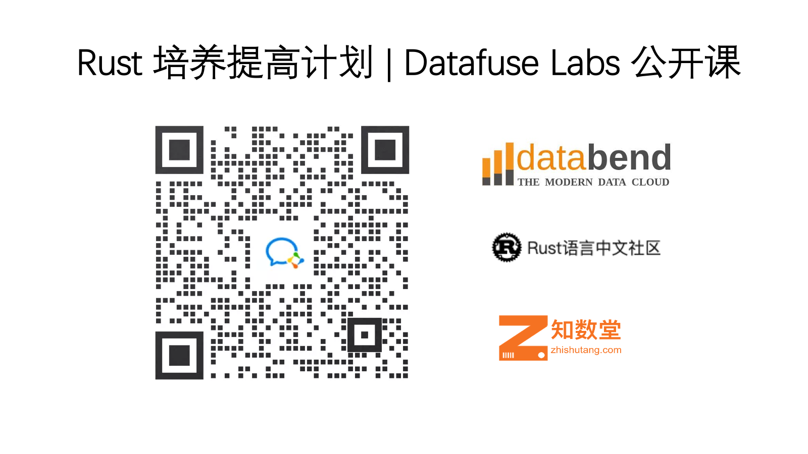

# rust-in-databend

Rust 培养提高计划

该课程是由 Datafuse Labs 发起，联合 Rust 语言中文社区 ， 知数堂联合承办。

Databend 项目地址： https://github.com/datafuselabs/databend
欢迎 Star | Watch | Fork

往期视频回看： https://space.bilibili.com/275673537/channel/detail?cid=200962&ctype=0

如果对课程有建议或是想参与进来，也可以提 issue 交流。

